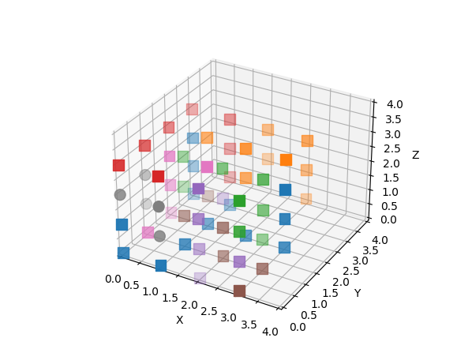

# puzzle-solver
Holds a brute force Python script to solve a tricky 3D printed 4x4x4 cube puzzle from
https://www.thingiverse.com/thing:2308116 

See "solution.txt" for the solution.

## Using solve4x4Cube.scala

Just run:
```
> scala solve4x4Cube.scala
```

The solution will be an array of numpy vectors you can paste in the `pieces` section
of `solutionDraw3d.py`. Like:

```
pieces = [
    np.array([[0,3,1], [0,0,0], [0,0,1], [0,3,0], [3,2,0], [3,2,2], [0,3,2], [1,2,0], [2,2,0], [1,0,0], [1,3,0], [3,2,1], [1,1,0]]),
    np.array([[3,3,1], [2,3,3], [2,2,3], [1,2,3], [3,3,2], [3,2,3], [2,3,2], [3,3,3], [2,2,2]]),
    np.array([[3,1,2], [3,1,3], [3,0,3], [2,1,3], [3,0,2], [3,1,1], [1,1,3], [1,1,2]]),
    np.array([[0,3,3], [0,2,3], [1,0,3], [1,3,1], [1,3,2], [1,3,3], [0,1,3], [0,0,3]]),
    np.array([[2,1,2], [2,0,1], [2,0,2], [2,0,3], [2,0,0], [3,0,1]]),
    np.array([[2,1,0], [3,0,0], [1,1,1], [2,1,1], [3,1,0], [1,2,1]]),
    np.array([[0,2,1], [0,1,0], [1,2,2], [0,2,2], [0,2,0]]),
    np.array([[1,0,1], [0,1,2], [0,0,2], [0,1,1], [1,0,2]]),
    np.array([[2,3,0], [3,3,0], [2,3,1], [2,2,1]]),
]
```

You can then install dependencies and run the python script to get the full solution.

```
pip3 install numpy matplotlib
python3 solutionDraw3d.py
```

You will then get the following image. It maybebe hard to see the steps, so you can comment out lines 
and generate the block piece by piece. There is an example video also bellow.



[video solution](files/solution_steps.mov "A video with the steps to build the cube")

